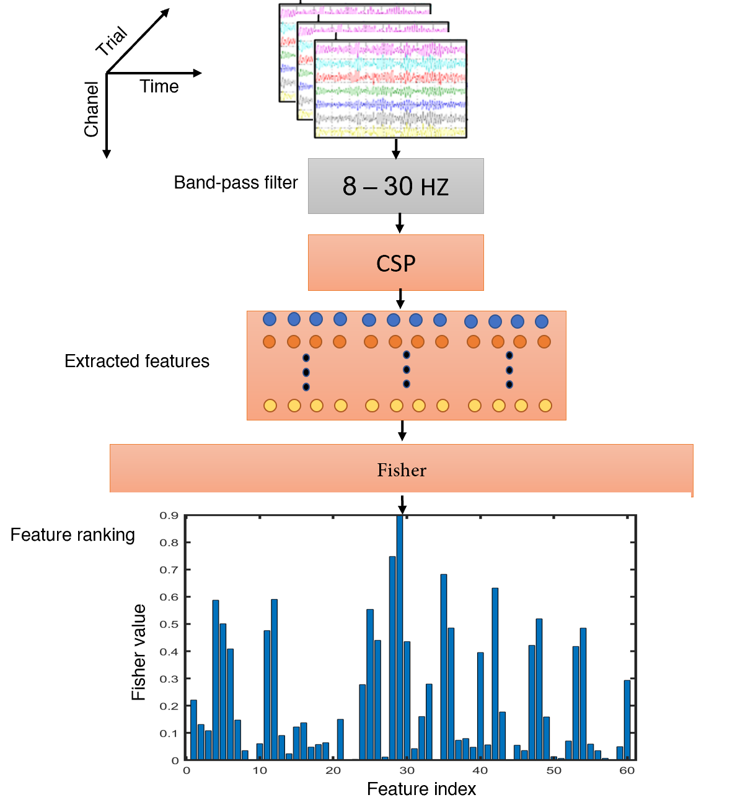
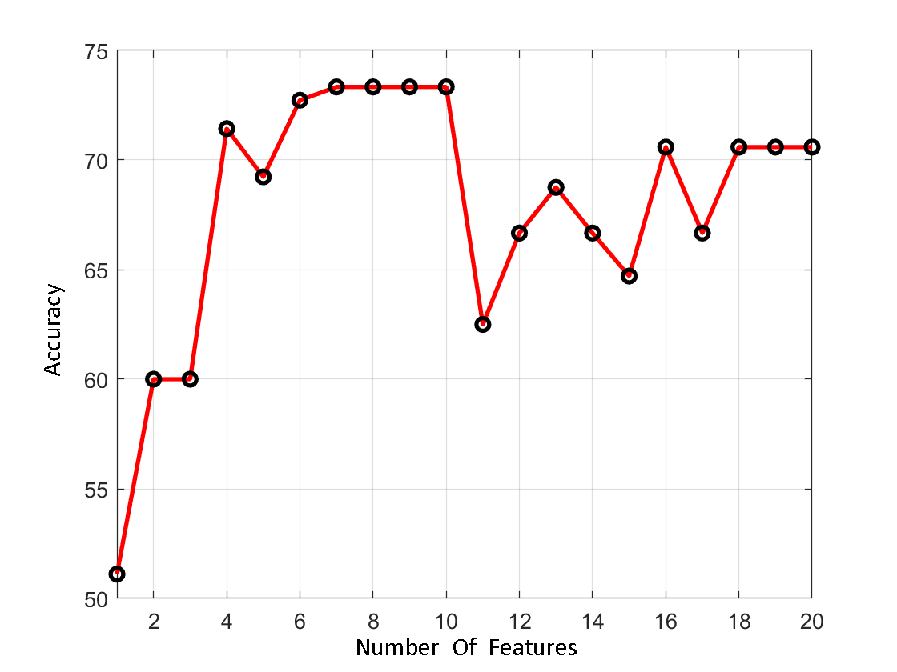
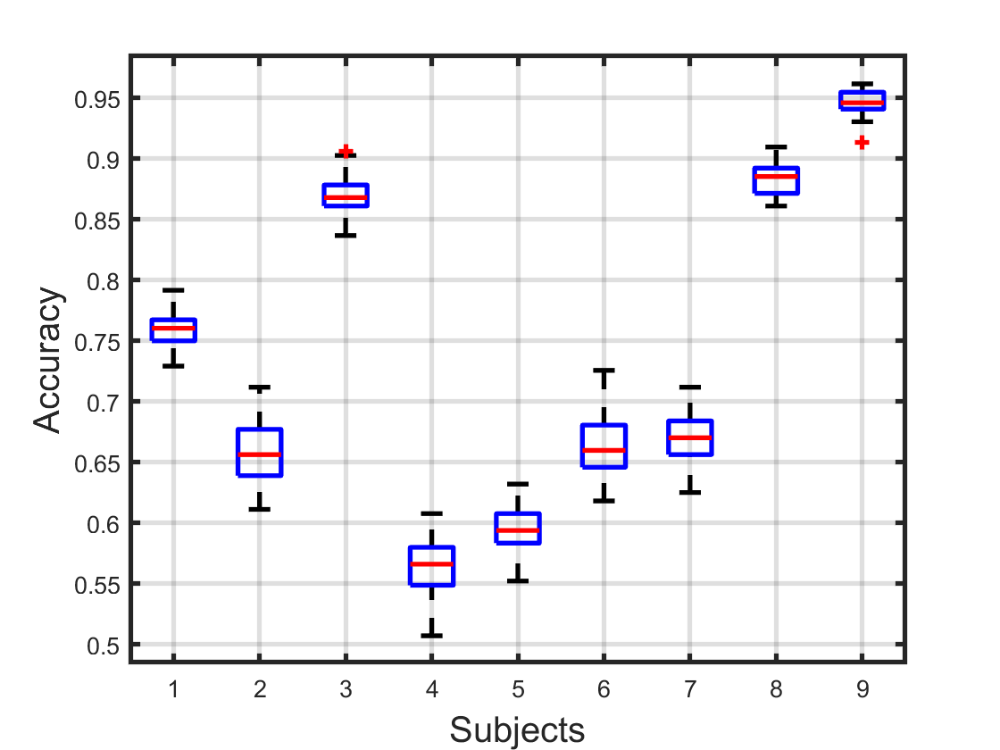

# Improving Classification of Multi class Motor Imagery by Statistical Feature Selection

# Abstarct:
Brain-computer interface (BCI) is a novel technology that is assisting not only disabled people but also healthy people to control an external device by using motor imagery (MI). Although much work has been done in BCI system, achieving ideal accuracy has not been achieved due to the difficulty of pattern recognition of EEG signals. BCI systems are made up of various components that perform preprocessing, feature extraction, and decision making. Common spatial pattern (CSP) is an effective algorithm which is extensively used in extracting feature of EEG motor imagery task. In this article, the CSP algorithm has extended to multi-class classification by one-versus-one (OVO) and one-versus-rest (OVR) methods. To improve classifier in terms of accuracy and less complexity, Fisher algorithm has been used. The average accuracy 73.41 ± 1.62 has been achieved on BCI Competition IV-IIa dataset. The experimental results show that the Fisher algorithm in reducing complexity and increasing accuracy of classifier has been effective.

* Overall framework

# Results:

* Accuracy of classification based on the number of features selected in participant 1

* The box plot of the accuracy obtained for each database participant

